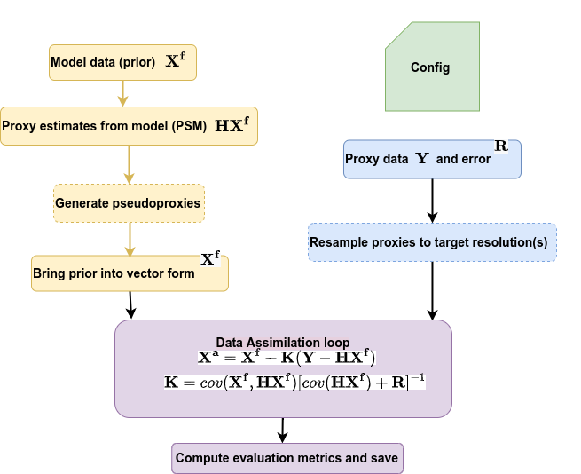
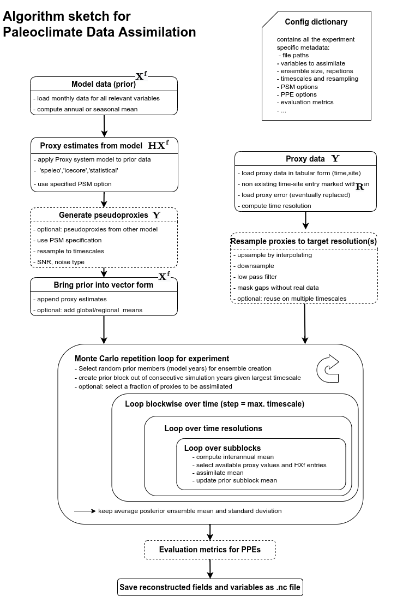

# PaleoDA - Reconstructing past climates with Data Assimilation
Code written in Python for my master thesis project.

With this code in  PaleoDA repository you can

* assimilate both real climate proxies and simulated (pseudo)proxies using "offline" DataAssimilation 
* apply proxy system models (PSMs, currently for icecores and speleothems)
* make use of isotope-enabled climate simulations
* use a multi-time-scale DA approach, such that proxies can be assimilated on more than annual timescales
(following Steiger, Hakim 2016, see comments below.)
* flexibly decide what you want to assimilate (e.g. only global mean temperature)
* chose if you want to assimilate absolute values or anomalies
* create multi-model ensembles with simulation data from different models
* use covariance localization or not
* apply various evaluation metrics during the reconstruction (especially for pseudoproxy experiments)

The code has the advantages of being
* kept simple and modular, mainly based on up to date xarray and numpy functions
* optimized with respect to speed, which in particular means how the  Ensemble Kalman Filter equations are implemented
* ready to be used in jupyter Notebooks (see the tutorials). Also you can easily deconstruct the wrapper and change it to your needs.
* versatile with respect to different Climate Proxy Datbases and climate model simulations in the sense that I provide instructions/examples how to bring these data into the right form.

There are some already existing PaleoDA codes online, I share some personal comments on them and their usability the last sections.

## Requirements for PaleoDA experiments

- Python environment specifications provided here:
- It's easiest if you create a new environement and try to reproduce mine there. You can try to loosen package version constraints if it doesn't work. Most package versions are as of 2022.

- This code can be run on a medium sized computer with a fair amount of Ram (>16gb). The prior (collection of climate states) is the major ram consuming part. Depending on the number of Monte-Carlo repetions you wish to perform (each time using a different prior/proxies) one experiment for 1000 years can run for a few hours.

## Structure of the Code

The following diagram visualizes how a typical PaleoDA is handled.
Dashed lines indicate optional steps.

For a more detailed version diagram look here:

In short, the proxies provide the temporal information of the reconstruction and the model priors inform on how to spread the information provided by the proxies through the whole climate fields.

### Efficiency considerations
- the observations from the model (HXf in the equations) are precalculated for each experiment
- different ensemble kalman filter techniques (all providing the same results) could be used. As this calculation is repeated thousand of times speed gain/loss is most likely to happen here.
I choose the Ensemble Transform Kalman Filter and the direct solver when using localization. I have a separate repository where I comment more on the strengths and weaknesses of the different algorithms: https://github.com/mchoblet/ensemblefilters
Running these algorithms on your machine will give you a good estimate of how long a full experiment will take.
- The multi-timescale approach adds some addtional computations. The creation of the prior block takes some time, and more importantly the mean/anomaly calculations that are repeated over and over. Although a standard operation, it is not parallelized in numpy, which I have changed using "numba". Depending on your machine, this can give some serious speedup (~5 for this one operation)

## Tutorials
Notebooks about the following topics are provided.
- how to prepare the config-file for experiments, what the entries mean **LINK**
- how to bring the climate model data into the right format (time,lat,lon, monthly resolution)
- preparing the proxy-data (). It's mainly about bringing it into a tabular form (time,proxy-site with lat/lon/psm specification)

## Multi-Timescale approach (adaptation of Steiger,Hakim 2016)

The usual PaleoDA approach allows for updating yearly means with the availably climate proxy data.

One of the challenges for the project behind this code was the incorporation of proxies which do not represent annual values. Therefore I followed the idea developed in Steiger/Hakim 2016 where multi-year averages are updated instead of only the annual averages which requires the extension of the prior, a vector containting some random climate states to a prior block consisting of these climate states and the <x> consecutive years.

In contrast to this publication
* the proxies are assimilated all at once instead of serially (faster)
* to that end the proxies are "binned" into blocks for the timescales using a simple resample procedure. The time resolution of one proxy is estimated from the available values and rounded to the prescribed time-scales. You can also define a time-resolution for each proxy database by hand.

The advantages of this multi-timescale approach:
* proxies can be used at their respective timescale
* the timescale appropriate spatial covariance relationships are used in this reconstruction
    
## Single vs Multi-Model Approach

You can choose to use one model as a prior or a multimodel ensemble. As studied in Amrhein 2020 https://agupubs.onlinelibrary.wiley.com/doi/full/10.1029/2020GL090485 and Parsons 2021 https://agupubs.onlinelibrary.wiley.com/doi/10.1029/2020EA001467
this multimodel approach better captures the spatial degrees of the freedom of the reconstruction and also gives a more reasonable prior and posterior reconstruction uncertainty.

## Proxy-System-Models (PSMs)
    
The observations from the model (HXf in the equations) are computed before the data assimilation loop. You can either use no psm (the model value closest to the proxy location is chosen) or use the following physics based proxy-system models with options that you can turn on or off separately.

**Icecore d18O:**

* Precipitation weighted annual mean
* model/proxy-height correction
* diffusion (code from PRYSM, by Sylvia Dee)

**Speleo d18O:**
* Precipitation/infiltration weighted annual mean
* model/proxy-height correction
* karst fractionation (using mean/changing model temperature  at location)
* karst filter
    
**linear**
    - a classical linear regression where the slopes and intersections have been calculated *previously* and are passed through via the Proxy-Database-File.
    
## Covariance localization

Covariance localisation is a technique used in Data Assimilation when ensemble sizes are small (~10) and spurious long-range correlations can be introduced. In this Offline-DA approach, we can select prior ensembles of size 100 or more, so the covariances inherent in the model should be treated as "real". However some studies use it, so I also provide an option to use it with a specific decorrelation radius. As in other studies, the Gaspari-Cohn-Function of fith order is applied. This uniform value is a bit arbitrary, some studies tried to justify it with pseudoproxy/external validation experiments, which usually results in really large radii (>12000km)
    

## Limitations

- "Statistical" PSM refers to only one database.
- Not using clases and decorators: As xArray-object provide many advantages, I do not see a huge necessity for simplifying the code with Classes. However decorators around some of my functions would probably make some parts simpler.

## Comments about existing PaleoDA
    
The first publicly available PaleoDA was the code for the Last Millenium Reanalysis (LMR), other packages, also mine have mainly followed their structure (lmr-lite-wrapper). Some comments:
    
Last Millenium Reanalysis (Python): https://github.com/modons/LMR
    - I tried to install it once, but some package dependencies are really hard because it relies on old numpy and panda packages. Other disadvantages are that the code is outdated, it is really nested and defines it own classes. Nowadays a lot of the things done by hand there can be hugely simplified using xArray. Furthermore the code is a difficult to understand, making changes is not straight forward. It is based on a serial kalman filter, which is slower than other ensemble kalman filters for typical PaleoDA dimensions (There is actually an optimized Kalman Filter hidden in the code, it resembles the ETKF)

- Derivates of the the LMR-Code:
    - LMR Online https://github.com/frodre/LMROnline, based on the original LMR, adapted for "online" DA with a linear inverse model
    - LMR Turbo https://github.com/fzhu2e/LMRt:
    Simplified the code considerably (more similar to my code structure, still not really using ), however "Turbo" is a bit of a misnomer because it only refers to the precalculation of the Proxy estimates from the model as far as I understand. The Kalman Filter is also the slow serial one.

Holocene Reconstruction code (Python) (https://github.com/Holocene-Reconstruction/Holocene-code):
    
* based in parts on LMR, more straightforward and easier to understand. Created for assimilation of the Temp12k database proxies (without PSMs) with transient priors.

PHYDA (Matlab):
* it looks more straight forward and easier to understand than LMR, but as I don't use Matlab I have not tested it.
*  https://github.com/njsteiger/PHYDA-v1

 DASH (Matlab):
* provides collection of matlab code for performing all kinds of PaleoDA experiments. I have also not really looked into that code as it is written in Matlab.
* https://github.com/JonKing93/DASH

